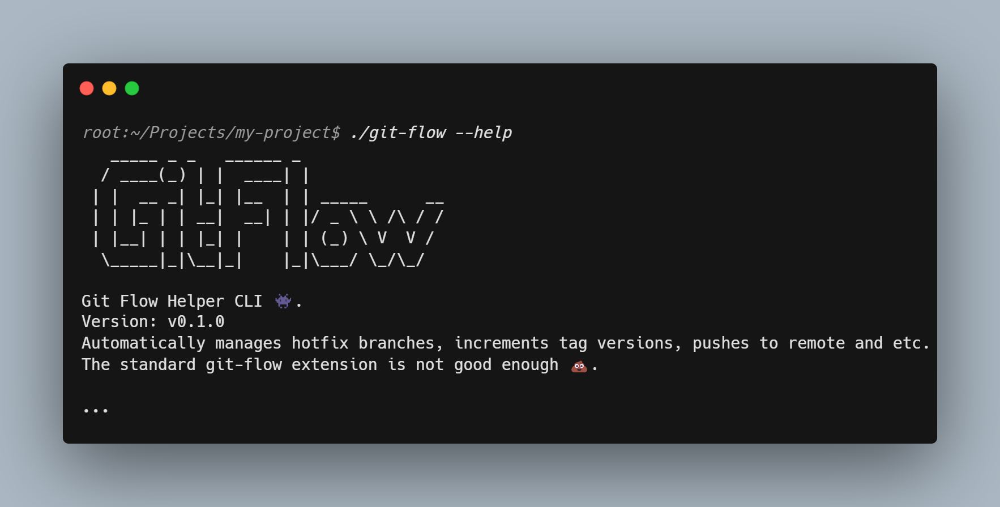

# Better Git Flow Helper CLI 👾

<div align="center">
  <a href="https://github.com/Edgar-P-yan/xml-class-transformer">
    
  </a>
  <br>
  <br>
</div>

[](https://github.com/pylint-dev/pylint)


Automatically manages hotfix branches, increments tag versions, pushes to remote and etc.
The standard git-flow extension is not good enough 💩.

**This repository's flow is managed by itself as proof of concept!**

## How to use

Just copy the [./git-flow](https://github.com/Edgar-P-yan/better-git-flow-cli/blob/main/git-flow)
file into the root folder of your repo, then make it executable:

```bash
wget https://raw.githubusercontent.com/Edgar-P-yan/better-git-flow-cli/v0.4.0/git-flow -O git-flow && chmod +x ./git-flow
```

And then use it like:

```
./git-flow fix start
```

## Available commands

- `./git-flow fix start [TAG]` - Creates new "hotfix/\*" branch with next-patch-version
  name, or with the specified name.

- `./git-flow fix finish` - Merges current `hotfix/*` branch into `main` and `develop`,
  sets tags, and pushes to remote. If anything worked successfully, then deletes the
  hotfix branch.

- `./git-flow feat start DESCRIPTION` - Start feature branch. Works only on `develop`
  and `release/*` branches.

- `./git-flow feat finish [-mr]` - Finishes feature. Merges into develop branch. If the
  `-mr` flag is specified then it also merges into the latest `release/*` branch, and
  increments `-rc.*` version on it.

- `./git-flow help` - Helper.

## Why not to use the standard git-flow extension?

The standard extension does not provide straight forward way of automatically incrementing tags,
does not automatically push changes to remote, so you have to type more commands. In contrast,
this simple python script automatically increments patch version from your latest tag, automatically
merges fixes into `main` and `develop` branches, and automatically pushes changes to remote.

In future, I might also add autmatic creation of Pull Requests via GitHub's CLI tool. But for now,
this simple script will do the job.

## How to use it in Windows?

This CLI helper works just fine in UNIX-like systems. I recommend Windows users to use WSL/WSL2, since they
are very developer-oriented, and work as usual UNIX system. But if you want to stick with the standard
Windows CMD then take the [git-flow.bat](./git-flow.bat) file into your projects root directory, it'l run
the python script as needed.

## Contribution

### Testing

Use `unittest` for testing:

```bash
python3 tests/git-flow_test.py
```

## Licence

[MIT Licence](./LICENSE)
